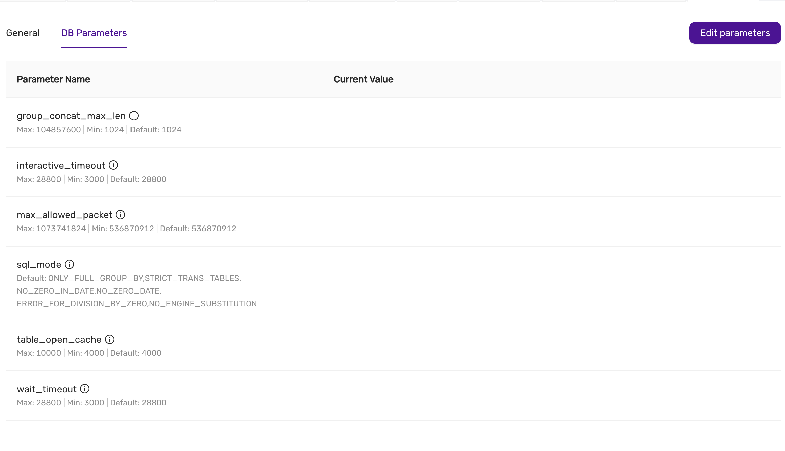

# Database configuration in CCX

In CCX, you have the ability to fine-tune your database performance by adjusting various **DB Parameters**. These parameters control the behavior of the database server and can impact performance, resource usage, and compatibility.

## Available DB Parameters
This is an example, and is subject to change and depends on the configuration of CCX.
1. **group_concat_max_len**
   - **Description**: Specifies the maximum allowed result length of the `GROUP_CONCAT()` function.
   - **Max**: 104857600 | **Min**: 1024 | **Default**: 1024

2. **interactive_timeout**
   - **Description**: Sets the number of seconds the server waits for activity on an interactive connection before closing it.
   - **Max**: 28800 | **Min**: 3000 | **Default**: 28800

3. **max_allowed_packet**
   - **Description**: Specifies the maximum size of a packet or a generated/intermediate string.
   - **Max**: 1073741824 | **Min**: 536870912 | **Default**: 536870912

4. **sql_mode**
   - **Description**: Defines the SQL mode for MySQL, which affects behaviors such as handling of invalid dates and zero values.
   - **Default**: `ONLY_FULL_GROUP_BY, STRICT_TRANS_TABLES, NO_ZERO_IN_DATE, NO_ZERO_DATE, ERROR_FOR_DIVISION_BY_ZERO, NO_ENGINE_SUBSTITUTION`

5. **table_open_cache**
   - **Description**: Sets the number of open tables for all threads.
   - **Max**: 10000 | **Min**: 4000 | **Default**: 4000

6. **wait_timeout**
   - **Description**: Defines the number of seconds the server waits for activity on a non-interactive connection before closing it.
   - **Max**: 28800 | **Min**: 3000 | **Default**: 28800

## How to Change Parameters

1. Navigate to the **DB Parameters** tab within the **Settings** section.
2. Review the list of available parameters and their current values.
3. Click on the **Edit Parameters** button in the upper-right corner.
4. Adjust the values as necessary within the defined minimum and maximum limits.
5. Once you’ve made the required changes, save the new configuration.

## Best Practices

- **Understand the impact**: Changing certain parameters can significantly impact the performance and stability of your database. Make sure to test changes in a staging environment if possible.
- **Stay within limits**: Ensure that your values respect the maximum and minimum bounds defined for each parameter.
- **Monitor after changes**: After adjusting any parameter, monitor your database performance to ensure the changes have the desired effect.

By properly configuring these parameters, you can optimize your database for your specific workload and operational requirements.
