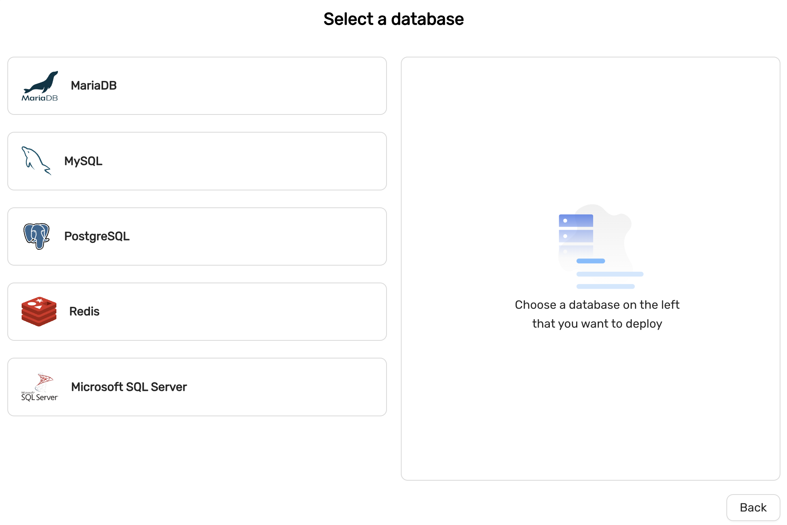

# Deploying a datastore

## MySQL or MariaDB
MySQL 8.0 is recommended for general purpose. 
MariaDB is recommended if you are migrating from an existing MariaDB system.
Moreover, MySQL 8.0 offers a more sophisticated privilege system which makes database administration easier.

### High-availability
MySQL and MariaDB offers two configurations for High-availability.
* Primary/replica (asynchronous replication)
* Multi-primary (Galera replication)

Primary/replica is recommended for general purpose.

### Scaling
MySQL and MariaDb can be created with one node (no high-availability) and can later be scaled with read-replicas or Primarys (in case of Multi-primary configuration).

## PostgreSQL
PostgreSQL 15 and later supports the following extensions by default:
* PostGis
* PgVector
### High-availability
High-availability is facilitated with PostgreSQL streaming replication
### Scaling
PostgreSQL can be created with one node (no high-availability) but can later be scaled with read-replicas.

## Redis
Redis is an in-memory data structure store.
### High-availability
High-availability is facilitated with Redis replication and Redis Sentinels.
### Scaling
Redis can be created with one node (no high-availability) but can later be scaled with read-replicas.

# MS SQLServer
Microsoft SQLServer 2022. Special license restrictions apply and this option may not be available.