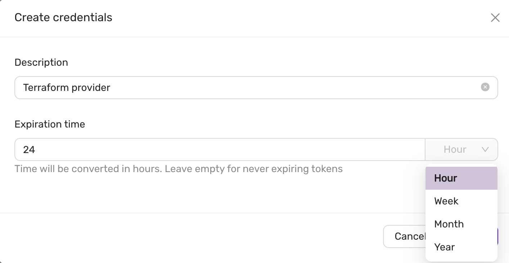
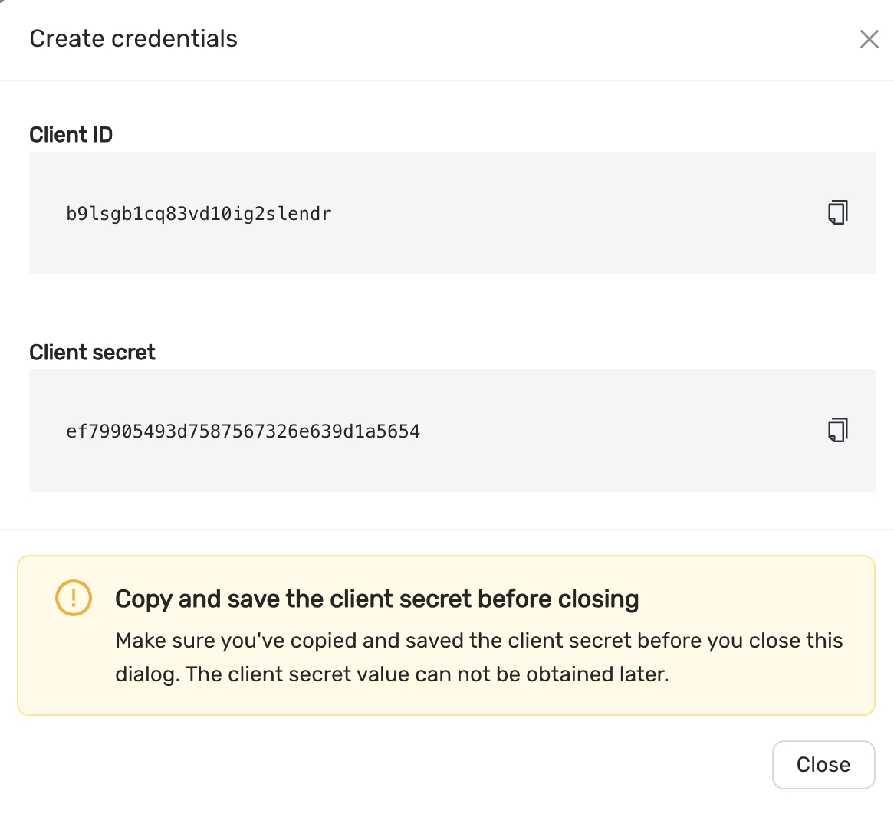

# Terraform provider 
The CCX Terraform provider allows to create datastores on all supported clouds.
The CCX Terraform provider project is hosted on [github](https://github.com/severalnines/terraform-provider-ccx).
## Oauth2 credentials
Oauth2 credentials are used to authenticate the CCX Terraform provider with CCX.
You can generate these credentials on the Account page Authorization tab.

And then you will see:


## Terraform provider

### Requirement
- Terraform 0.13.x or later

### Quick Start

1. Create Oauth2 credentials.
2. Create a `terraform.tf` 
3. Set `client_id`, `client_secret`, below is a terraform.tf file:

```terraform
terraform {
  required_providers {
    ccx = {
      source  = "severalnines/ccx"
      version = "~> 0.3.1"
    }
  }
}

provider "ccx" {
    client_id = `client_id`
    client_secret = `client_secret`
}

resource "ccx_datastore" "luna_postgres" {
  name           = "luna"
  size           = 1
  db_vendor      = "postgres"
  tags           = ["new", "test"]
  cloud_provider = "aws"
  cloud_region   = "eu-north-1"
  instance_size  = "m5.large"
  volume_size    = 80
  volume_type    = "gp2"
  network_type   = "public"
}
```
Then run:
- `terraform init`
- `terraform apply `

Login to CCX and watch the datastore being deployed.


### VPC  (AWS)

Optionally you can create a VPC (supported by AWS)

```terraform
resource "ccx_vpc" "venus" {
    vpc_name = "venus"
    vpc_cloud_provider = "aws"
    vpc_cloud_region = "eu-north-1"
    vpc_ipv4_cidr = "10.10.0.0/16"
}
```

In that case set:

```terraform
    network_type = "private"
    network_vpc_uuid = ccx_vpc.venus.id
```

in the resource "ccx_datastore" section, see also [example_datastore.tf](examples/example_datastore.tf)

### Advanced Usage

#### Database Parameters

Database parameters can be configured for the cluster by using the block `db_params` inside the `ccx_datastore` block as follows:

```terraform
db_params {
   sql_mode = "STRICT"
}
```

The parameters will depend on the database vendor and version.
Refer to the `Settings > DB Parameters` section for a list of available parameters.

#### Firewall Settings

Firewall settings can be configured for the cluster by using the block `firewall` inside the `ccx_datastore` block as follows:

```terraform
firewall {
   source = "x.x.x.x/32"
   description = "description here"
}

firewall {
   source = "y.y.y.y/32"
   description = "description here"
}
```

You may add multiple firewall blocks to allow multiple IP addresses.

#### Notifications

Notifications can be configured for the cluster by including the following blocks inside the `ccx_datastore` block:

```terraform
notifications_enabled = true # or false
 notifications_emails = ["your@email.com", "your2@email.com"] # 
```

#### Maintenance Settings

Maintenance settings can be configured for the cluster by including the following blocks inside the `ccx_datastore` block:

```terraform
maintenance_day_of_week = 2 # 1-7, 1 is Monday
maintenance_start_hour = 2 # 0-23
maintenance_end_hour = 4
```

#### Scaling the cluster

Scaling the cluster can be done by changing the `size` parameter in the `ccx_datastore` block. When downscaling, the oldest non-primary node will be removed.
